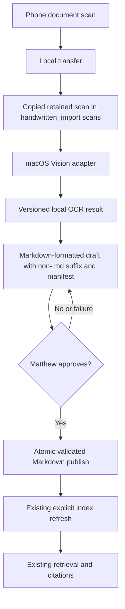

# Local Handwritten Journal Import - Plan

## Goal Capsule

- **Objective:** Let Matthew turn a handwritten journal page into a trustworthy, searchable local journal entry without manually transcribing it first.
- **Means:** Add a macOS-native OCR import path that creates a reviewable Markdown draft before it enters the established local journal workflow. (KTD2)
- **Product authority:** The Product Contract below is the source of truth for the first handwritten-import milestone.
- **Stop conditions:** Stop if the local OCR capability is unavailable, if a draft cannot be reviewed safely, or if implementation would require private journal content, cloud processing, telemetry, or automatic ingestion.
- **Tail ownership:** Matthew approves every entry and decides when to refresh the existing index.

---

## Product Contract

### Summary

Second Mind will accept a locally transferred handwritten scan and produce a private Markdown draft for review.
The approved draft will then join the existing Markdown-based journal and retrieval workflow, while the original scan remains stored locally.

### Problem Frame

Matthew currently leaves handwritten pages on paper or manually types them to make them usable in Second Mind.
Manual transcription adds enough friction that handwritten entries remain outside the searchable personal archive.

### Key Decisions

- **Guided local import over a custom phone app** (session-settled: user-approved — chosen over a custom phone-to-computer companion: native scanning and local transfer prove the value with less device and sync complexity). Governs R1, R2, R8.
- **Review before indexing** (session-settled: user-directed — chosen over automatic ingestion: handwriting recognition must be checked before it can affect retrieval). Governs R4, R5, R6.
- **Keep the original scan locally** (session-settled: user-directed — chosen over deletion after transcription: the scan remains the source of truth until Matthew chooses to triage storage). Governs R3, R7.
- **Propose metadata, then require confirmation** (session-settled: user-approved — chosen over always entering date and title manually: OCR should reduce effort without making handwritten metadata authoritative). Governs R4, R5.

<!-- ce-section: work-relationships -->
### How This Work Fits Together

This plan owns handwritten-page import into the established local Markdown workflow.

- The M030 usage-evidence milestone can proceed independently; it still requires real use and remains incomplete.
- A future Mac mini can take over the computer-side import role without changing the first-version capture flow.
- Custom phone apps, multi-device synchronization, and automated storage triage remain separate future decisions.

### Actors

- A1. Matthew captures pages with the native iPhone document scanner, transfers them locally, reviews OCR drafts, and explicitly approves entries.
- A2. Second Mind processes only the locally available scan, proposes a draft, and preserves the existing journal workflow after approval.

### Requirements

**Capture and local handling**

- R1. The import workflow accepts a phone-captured journal scan that Matthew has transferred locally to the active computer.
- R2. The workflow keeps journal scans and all derived content local, without cloud upload, telemetry, hosted APIs, or background network transmission.
- R3. The workflow retains each original scan locally after a successful entry approval.

**Draft and review**

- R4. The workflow produces an editable Markdown draft from the scanned handwritten page and proposes the entry date, title, gratitude list, and body when recognizable.
- R5. The workflow requires Matthew to confirm or correct the proposed date, title, and transcription before creating a journal entry.
- R6. An unapproved draft must not be indexed, retrieved, or treated as part of the journal library.

**Compatibility and trust**

- R7. An approved draft becomes a dated Markdown entry that remains compatible with the existing ingestion, chunking, indexing, citation, and retrieval workflow.
- R8. The first version uses a deliberate import action; it does not watch folders, auto-import scans, or require a custom phone application.

### Key Flows

- F1. Scan-to-draft
  - **Trigger:** Matthew transfers a phone scan to the active computer and starts an import.
  - **Actors:** A1, A2.
  - **Steps:** Second Mind processes the local scan, proposes a Markdown draft and recognizable metadata, and presents the result for editing.
  - **Outcome:** A private, unapproved draft exists; the scan and draft have not entered retrieval.
  - **Covers:** R1, R2, R4, R6, R8.

- F2. Review-to-entry
  - **Trigger:** Matthew reviews the draft.
  - **Actors:** A1, A2.
  - **Steps:** Matthew corrects or confirms the transcription, date, and title, then explicitly approves the entry.
  - **Outcome:** Second Mind retains the original scan locally and makes the approved Markdown entry available to the current journal workflow.
  - **Covers:** R3, R5, R7.

### Acceptance Examples

- AE1. **Covers R4, R5, R6.**
  - **Given:** A local scan contains a handwritten date, title, gratitude list, and journal body.
  - **When:** Second Mind creates its draft.
  - **Then:** Matthew can correct all proposed content, and none of it is searchable until approval.

- AE2. **Covers R3, R7.**
  - **Given:** Matthew approves a corrected draft.
  - **When:** The entry is added to the journal library.
  - **Then:** The original scan remains local and the Markdown entry works with the established retrieval and citation behavior.

- AE3. **Covers R2, R8.**
  - **Given:** Matthew has not started an import.
  - **When:** A scan exists in a local folder.
  - **Then:** Second Mind does not process or transmit it automatically.

### Success Criteria

- A clearly fictional handwritten sample can complete the scan-to-approved-entry flow locally.
- The approved sample is retrieved with the same date and source traceability expected of a typed entry.
- Tests prove that unapproved drafts cannot affect the index or retrieval results.

### Scope Boundaries

**Deferred for later**

- A custom iPhone app, device pairing, direct phone-to-Mac-mini synchronization, and remote-control workflows.
- Automatic storage triage or deletion of retained scans.
- Multi-page batching and richer handwritten-layout features beyond the first proven import flow.

**Outside this milestone**

- Cloud OCR, hosted storage, telemetry, background scanning, and automatic import.
- Changes to answer generation, retrieval strategy, usage-evidence logging, or the current privacy rules for real journals.

### Dependencies and Assumptions

- Matthew will use the native iPhone document scanner and transfer scans locally before initiating import.
- The active computer will use the approved macOS Vision path, with a local capability preflight before processing any scan.
- OCR quality varies with handwriting and scan quality, so approval remains mandatory.

---

## Planning Contract

### Product Contract Preservation

Product Contract unchanged.

### Key Technical Decisions

- KTD1. **Use a dedicated top-level private import workspace.** Keep scan copies, draft manifests, and Markdown-formatted drafts with a non-`.md` suffix under `handwritten_import/`; no approved Markdown file may exist there. Governs R3, R6, R8.
- KTD2. **Use a small macOS Vision adapter for text recognition.** Invoke the operating system’s on-device text-recognition capability from a checked-in helper with a versioned local result contract; use PDFKit for fixed local single-page PDF preparation instead of adding a cloud provider or a general OCR Python dependency. Governs R2, R4.
- KTD3. **Treat OCR output as a proposed draft, not journal data.** Move an import through staged, draft, approved, or failed states; approval revalidates all paths and content, then uses a crash-safe no-overwrite publish of a conforming entry. Governs R4, R5, R6, R7.
- KTD4. **Keep index refresh explicit.** Approval does not call the existing index or session workflow, so Matthew retains the current control point for searchable data. Governs R6, R8.

### High-Level Technical Design

The import path adds a private pre-ingestion stage without changing the typed Markdown loader.
The existing index receives only approved Markdown entries.

### System-Wide Impact

The change creates a new private data lifecycle for scans and drafts.
It keeps the current parser, index, retrieval, and usage-evidence interfaces unchanged.
It adds narrow ignore rules so local originals and drafts cannot be committed by accident.

### Risks and Dependencies

- **Handwriting quality:** Recognition quality can vary by scan and handwriting. Mandatory review is the mitigation; private content is never used as automated test data.
- **macOS capability:** The chosen OCR path requires macOS Vision, PDFKit, the local Swift toolchain, and the checked-in helper. The import command must preflight all four and fail before staging data when unavailable.
- **Metadata ambiguity:** OCR may misread dates or titles. Approval must validate the date and existing Markdown filename rules before writing the approved entry.
- **Input format:** iPhone scans may be PDFs. Version one supports images and single-page PDFs rendered locally, and rejects encrypted, corrupt, unsupported, rotated-unreadable, and multi-page inputs before OCR.
- **Failure recovery:** A failed OCR or approval leaves the source transfer untouched and keeps the retained copy and editable draft for retry. It must not create a partial approved entry.
- **Local-resource limits:** Reject an input over 25 MiB or 20 megapixels before copying or rendering. Bound OCR execution to 30 seconds, bound helper output, and remove only temporary render files after each attempt.
- **Storage growth:** Retained scans can consume local storage. Storage triage remains manual and outside this milestone.

### Sources and Research

- `AGENTS.md` defines the local-only privacy boundary, the Markdown journal contract, and the current M030 non-goals.
- `README.md` documents the existing local ingestion, index, and retrieval workflow.
- `src/second_mind/journal.py` provides the approved-entry validation contract.
- `src/second_mind/index.py` indexes only entries returned by the Markdown loader.
- [Apple Vision text recognition](https://developer.apple.com/documentation/vision/recognizing-text-in-images) supports on-device text recognition and an accuracy-oriented path.
- [Tesseract FAQ](https://tesseract-ocr.github.io/tessdoc/FAQ.html) warns that Tesseract is designed for printed text and is not a strong baseline for handwriting.

---

## Implementation Units

### U1. Establish the top-level private workspace and import contracts

- **Goal:** Establish this approved OCR milestone in project guidance, then define the root-level `handwritten_import/` workspace and typed import-state objects without widening the existing Markdown ingestion layer.
- **Requirements:** R1, R2, R3, R6, R8.
- **Dependencies:** None.
- **Files:** Modify `AGENTS.md`; modify `.gitignore`; create `src/second_mind/handwritten_import.py`; create `tests/test_handwritten_import.py`.
- **Approach:**
  1. Update the active milestone boundary to permit this approved handwritten-import work while preserving M030 as independently incomplete.
  2. Define `handwritten_import/scans/`, `handwritten_import/drafts/`, and state storage for staged, draft, approved, and failed imports per KTD1 and KTD3.
  3. Copy, rather than move or rewrite, each chosen transfer source into a collision-safe retained-scan path with a local fingerprint.
  4. Validate canonical containment, reject symlinks and path escapes, and prevent approved Markdown output anywhere under the workspace.
  5. Use a Markdown-formatted draft with a non-`.md` suffix plus a private manifest so the normal loader cannot accept a draft even when pointed at the workspace.
- **Patterns to follow:** Use `pathlib.Path`, dataclasses, and explicit `ValueError` validation patterns from `src/second_mind/journal.py` and `src/second_mind/backup.py`.
- **Test scenarios:**
  - Project guidance permits the handwritten-import milestone without declaring M030 complete.
  - A synthetic local scan creates a staged record with distinct retained-scan, draft, and manifest locations.
  - A missing file, directory input, symlink, workspace escape, or destination inside the approved journal directory fails before staging.
  - A scan already staged in `handwritten_import/` remains outside the entry set returned by the normal loader and an explicit index run against the workspace finds no entries.
  - Same-named transfer sources receive distinct retained copies without altering either source file.
  - Repository verification confirms that no tracked path exists under `handwritten_import/`.
  - Root-anchored ignore rules match `handwritten_import/` without ignoring unrelated project images.
- **Verification:** The private workspace can hold a fictional scan and draft without appearing as a journal entry or a tracked file.

### U2. Add the on-device macOS text-recognition adapter

- **Goal:** Convert one locally available scan into ordered OCR observations without transmitting its contents.
- **Requirements:** R2, R4.
- **Dependencies:** U1.
- **Files:** Create `tools/second_mind_vision_ocr.swift`; modify `src/second_mind/handwritten_import.py`; modify `tests/test_handwritten_import.py`.
- **Approach:**
  1. Use a minimal Swift helper around macOS Vision text recognition with the accuracy-oriented mode, deterministic reading order, and a versioned machine-readable local result per KTD2.
  2. Prepare a single-page PDF through PDFKit at 300 DPI with orientation normalized before Vision runs; reject multi-page, encrypted, corrupt, unsupported, and unreadable inputs.
  3. Preflight the repository helper, Swift toolchain, Vision capability, and PDFKit path before staging data.
  4. Invoke the helper by argument vector without a shell, use the checked-in helper and controlled Swift resolution, minimize inherited environment, set time and output bounds, and validate the parsed result before persistence.
  5. Treat malformed output, unavailable prerequisites, and empty recognition as generic local failures without echoing scan paths or recognized text in diagnostics.
- **Execution note:** Start with an injectable OCR runner so parsing and safety tests use synthetic observations; reserve the Vision smoke check for a clearly fictional scan on macOS.
- **Patterns to follow:** Follow the project’s explicit command-boundary error handling in `src/second_mind/ingest.py` and `src/second_mind/index.py`.
- **Test scenarios:**
  - A fake local OCR runner returns ordered fictional lines, confidence, and geometry that the import workflow accepts.
  - A missing helper, Swift toolchain, Vision capability, or PDFKit support fails before the source copy and records no import state.
  - A malformed result, nonzero helper result, timeout, or empty recognition result marks a retained staged copy as failed, creates no draft, and preserves the source transfer for retry.
  - Single-page image and PDF fixtures succeed through fixed local preparation; corrupt, encrypted, unsupported, rotated-unreadable, multi-page, oversized, and over-dimension fixtures fail safely.
  - The adapter contract carries recognized text, confidence, and geometry locally without any network client, telemetry path, argument echo, or raw diagnostic output.
  - A macOS smoke check against a fictional scan confirms the helper can return text when the local capability is available.
- **Verification:** The adapter has a documented local preflight and produces no cloud fallback path.

### U3. Create editable drafts and require explicit approval

- **Goal:** Turn OCR observations into a reviewable Markdown draft and make approval the only transition into the approved journal directory.
- **Requirements:** R3, R4, R5, R6, R7.
- **Dependencies:** U1, U2.
- **Files:** Modify `src/second_mind/handwritten_import.py`; create `src/second_mind/handwritten_import_cli.py`; modify `src/second_mind/__init__.py`; modify `tests/test_handwritten_import.py`; create `tests/test_handwritten_import_cli.py`.
- **Approach:**
  1. Propose the first recognizable date and title while preserving the full editable transcription, including the gratitude list and body, per KTD3.
  2. Write the proposal as a Markdown-formatted draft with a non-`.md` suffix and a private manifest that records the draft identity, intended filename, and retained-scan fingerprint.
  3. On a separate approval action, re-resolve the draft, manifest, retained scan, and configured journal root; reject symlinks, path escapes, non-regular files, and destinations outside the journal root.
  4. Validate the existing date, title, body, and filename rules, then write and synchronize a same-directory temporary entry before a non-replacing publish and parent-directory synchronization.
  5. Mark a completed import only after publish succeeds; repeated approval of the same draft must be idempotent, and a different draft targeting an existing filename must fail without overwrite.
- **Execution note:** Build the approval boundary test-first because it protects the privacy and retrieval guarantee.
- **Patterns to follow:** Reuse `load_journal` as the final compatibility gate and the CLI structure from `src/second_mind.ingest`.
- **Test scenarios:**
  - Covers AE1. Fictional OCR text creates an editable draft that proposes date, title, gratitude list, and body but is not searchable.
  - A reviewer correction to the date, title, or transcription is the content written on approval.
  - Covers AE2. Approval creates a dated UTF-8 Markdown entry accepted by `load_journal` and leaves the retained scan in place.
  - Empty bodies, invalid dates, unsafe slugs, missing drafts, and duplicate destination names fail without overwriting an existing approved entry.
  - A repeated approval succeeds as an idempotent no-op, while a different draft with the same target filename fails and preserves both drafts.
  - A simulated publish failure leaves the retained scan and editable draft available for retry and leaves no partial approved Markdown file.
  - Failure injection before temporary write, before publish, and before completion state preserves recovery artifacts, never replaces an existing entry, and cleans up only temporary output.
  - Normal CLI status and errors use an opaque import identifier rather than an OCR-derived filename or full filesystem path.
  - An unapproved draft remains absent from the approved journal directory after command completion.
  - CLI help, invalid local paths, failed OCR, draft creation, and approval return clear success or error outcomes without printing journal content beyond the user-requested draft location.
- **Verification:** Only an explicit approval can create a Markdown file that the existing loader accepts.

### U4. Prove index isolation and document the local workflow

- **Goal:** Demonstrate that approved handwritten entries use the established retrieval path while drafts remain invisible, and document the capture-to-review workflow.
- **Requirements:** R2, R3, R6, R7, R8.
- **Dependencies:** U3.
- **Files:** Modify `tests/test_index.py`; modify `tests/test_app.py`; modify `tests/test_handwritten_import.py`; modify `README.md`.
- **Approach:**
  1. Exercise an approved fictional handwritten entry through the current explicit index and retrieval path per KTD4.
  2. Prove that a private draft and retained scan do not alter indexing or retrieval before approval.
  3. Document the iPhone-scan, local-transfer, draft-review, approval, and explicit-index steps without asking users to expose private journal text.
  4. Add a private local pilot in which Matthew classifies one voluntarily selected real scan only as usable, needs substantial correction, or unsuitable.
- **Patterns to follow:** Mirror the existing synthetic journal fixtures and reindexing checks in `tests/test_app.py`, `tests/test_index.py`, and `tests/test_sample_journals.py`.
- **Test scenarios:**
  - Covers AE3. A private scan and draft exist while a normal index refresh sees no new entry.
  - Approval alone leaves the current index unchanged and returns no new retrieval result before the later explicit refresh.
  - Covers AE2. An approved fictional entry is indexed once, remains duplicate-free on a second refresh, and returns the existing date and source citation shape.
  - The current typed sample-journal suite remains unchanged and continues to prove the original workflow.
  - The documentation tells users to use a deliberate import and never claims automatic scanning, cloud backup, or cross-device synchronization.
  - The local pilot records only its coarse outcome and never journal content, OCR text, titles, paths, or citations.
- **Verification:** The full fictional scan-to-approved-entry path passes locally, and the established typed-journal behavior remains intact.

---

## Verification Contract

| Area | Evidence | Done signal |
| --- | --- | --- |
| Core behavior | The Second Mind test suite | Existing typed-journal behavior and new synthetic import behavior both pass. |
| OCR adapter | macOS local smoke check with a clearly fictional scan, then an optional private local pilot | The adapter returns usable text or fails safely; the pilot records only whether review effort is usable, substantial, or unsuitable. |
| Privacy boundary | Ignore-rule and index-isolation tests | Retained scans and drafts are not tracked, indexed, or retrieved before approval. |
| Compatibility | Existing ingestion, indexing, and retrieval tests | An approved draft satisfies the current Markdown contract and retains citation behavior. |
| Documentation | README review | The workflow names local transfer, review, approval, and explicit indexing accurately. |

---

## Definition of Done

- All implementation units are complete and their focused tests pass with fictional data only.
- The full test suite passes without reading private journals or notes.
- A clearly fictional scan can produce a draft, survive review and approval, and then enter the established index only after an explicit refresh.
- Retained scans and unapproved drafts are locally stored, ignored by Git, and absent from retrieval results.
- The README describes the local-first workflow and its deliberate boundaries.
- Any abandoned OCR adapter or test scaffolding is removed before completion.
